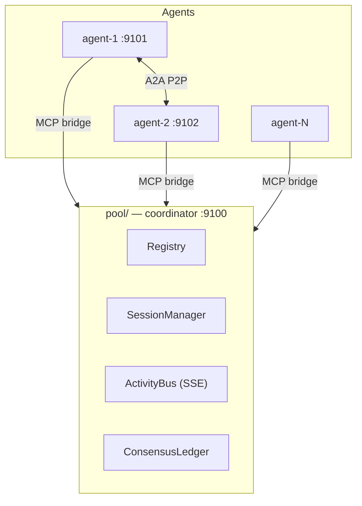

# agentpool — multi-agent A2A pool with critique-and-converge sessions

Extends the `claude-a2a` P2P pattern into a multi-agent pool:

1. **Any agent can register** to the pool coordinator (exposed to each agent as MCP tools).
2. **Any agent can bind to a session** among agents (dynamic N-member sessions with a shared goal).
3. Agents **watch each other's activity**, **critique** after another finishes,
   **self-improve**, and keep working **with no human intervention** until the shared
   goal satisfies every member — enforced by a coordinator state machine with
   termination guards.

## Topology



Control plane (register/session/activity/critique/consensus) is centralized in the
pool; real work + direct messaging stays P2P A2A.

## Layout

```
shared/a2a.py            A2A protocol (message/send, tasks/get, SSE, push, respond/inbox)
shared/pool_client.py    client for the pool control plane
shared/mcp_bridge.py     per-agent MCP bridge (pool tools + P2P tools)
pool/store.py            Registry, SessionManager, ActivityBus, ConsensusLedger, FSM
pool/coordinator.py      JSON-RPC control plane + SSE watch
pool/server.py           pool entry (default :9100)
agent-template/          parametrized agent (server.py, CLAUDE.md, .mcp.json, make_agent.py)
demo/simulated_agent.py  deterministic agent (no LLM) exercising the full loop
demo/run_session.py      end-to-end runner (pool + N agents -> satisfied/failed)
demo/real_review.py      runner that plays real LLM-agent review output through the pool FSM
demo/real_review_payload.json  example payload (3 agents review torchimpulse, 3 critiques)
tests/                   pool / session / consensus tests
```

## Quick start

```bash
uv sync
uv run pytest                                   # unit tests
uv run python demo/run_session.py --num-agents 3   # full autonomous loop, no LLM
```

Run the pool standalone:

```bash
uv run python -m pool.server                     # pool on :9100
```

Generate a concrete agent (for real Claude Code sessions):

```bash
uv run python agent-template/make_agent.py --id agent-1 --port 9101 --role "writes section 1"
# boot the agent's own A2A server first (agentpool_inbox / agentpool_respond need it):
#   set AGENT_PORT=9101 && uv run python agents/agent-1/server.py
cd agents/agent-1 && claude                     # loads its .mcp.json MCP server
```

Note: `make_agent.py` only scaffolds the agent — it does **not** launch
`server.py`. Start that server with the matching `AGENT_PORT` before running
`claude`, or the peer-messaging tools will fail.

## Session state machine

`forming -> working -> reviewing -> revising -> satisfied | failed`

- An agent posts `finished` → session enters `reviewing`.
- Peers post `critique` against flawed output → opens a thread, revokes the target's
  approval, session enters `revising`.
- Target resolves critiques (`self-improved`, back to `reviewing`) and re-posts `finished`.
- A member posts `satisfied` when it has no objections.
- Session reaches `satisfied` when **all members are satisfied and no critique
  threads are open**.

Termination guards (exactly two): **max iterations** (a cap on total critiques,
`session.iteration` is incremented only in `critique_send`) and **global timeout**.
Both → `failed`. There is no separate no-progress detector.

## Real review demo (LLM agents, not simulation)

`demo/run_session.py` drives deterministic simulated agents whose "work" is a
token-matching game (`APPROVED` substring) — they prove the loop's plumbing but
never read real code. `demo/real_review.py` is the counterpart that runs the same
pool FSM over **real LLM-agent output**, so the critique/self-improve steps carry
actual review content:

1. **Review** — N real agents each review a slice of a target repo and produce
   findings.
2. **Critique** — each agent critiques a peer's findings (round-robin), catching
   wrong file references, false positives, and missed defects.
3. **Revise** — each agent self-improves its findings in response to the critique
   it received.
4. The outputs are collected into a payload JSON, and `demo/real_review.py` plays
   them back through the pool control plane
   (`register → join → started → finished → critique → resolve → finished → satisfy`),
   ending when the session converges to `satisfied`.

```bash
uv run python demo/real_review.py --payload demo/real_review_payload.json
```

Payload shape (see `demo/real_review_payload.json`):

```json
{
  "goal": "Review ... and converge on a severity-ranked defect list.",
  "agents": [
    {"id": "agent-1", "role": "...", "findings": "...",
     "critique_of": "agent-2", "critique_text": "...", "revised": "..."}
  ]
}
```

The coordination (state machine, consensus, termination guards) is the real pool;
the agent work is real review content produced upstream by the LLM agents and
replayed here. The P2P `message/send` data plane is not exercised in this path —
it remains for real Claude Code agents via `shared/mcp_bridge.py`.

## Security scope

Loopback-only demo. The pool has **no authentication or authorization**: any
process that can reach the pool port may register as any `agentId`, join any
session, send critiques, resolve them, or declare satisfaction on another agent's
behalf. `AgentStatus.offline` and `lastHeartbeat` are written but not enforced
(no liveness sweeper). Do not expose the pool beyond `127.0.0.1`.

## MCP tools (per agent)

`agentpool_register`, `agentpool_list_agents`, `agentpool_send_to`, `agentpool_inbox`, `agentpool_respond`,
`agentpool_session_create`, `agentpool_session_join`, `agentpool_session_leave`, `agentpool_session_status`,
`agentpool_session_list`, `agentpool_set_goal`, `agentpool_post_activity`, `agentpool_watch`, `agentpool_critique`,
`agentpool_resolve_critique`, `agentpool_declare_satisfaction`.
