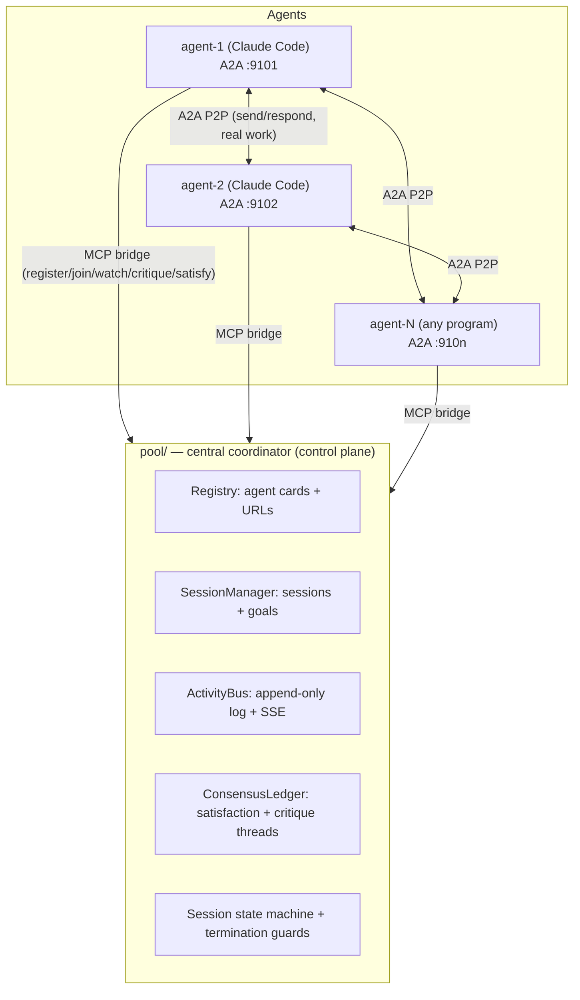

# A2A Pool MCP — Implementation Plan

## Goal

Extend `claude-a2a` (D:\GitRepo-AI\claude-a2a) from a fixed 2-agent P2P demo into a
multi-agent pool where:

1. Any agent can register to the A2A pool MCP.
2. Any agent can bind to a session among agents.
3. Agents watch each other's activity, send critique after another finishes, criticize
   each other, self-improve, and keep working with no human intervention until the
   shared goal satisfies all agents in the session.

## Current state (what we build on)

- `shared/a2a.py` — faithful A2A JSON-RPC subset (`message/send`, `tasks/get`, SSE
  stream, push, respond/inbox) with an in-memory `TaskStore` + pub/sub.
- `shared/mcp_bridge.py` — per-agent stdio MCP bridge wrapping **one hardcoded peer +
  one local** endpoint.
- `agent-a/`, `agent-b/` — two fixed agents (each: A2A HTTP server + `.mcp.json` +
  `CLAUDE.md`), P2P only.
- 36 pytest tests, `make up/smoke/test/demo`.

Hard limits today: 2 fixed agents, no registry, no sessions, no shared activity feed,
no critique/termination loop. All three requirements need a **central control plane**;
the P2P A2A stays as the data plane.

## Target architecture



**Design choice (recommended):** control plane centralized in the pool; work/critique
delivery stays P2P A2A (reuses existing `send/respond/push`). Agents are configured
with only their own id + the pool URL; peer URLs are resolved from the registry.

## Mapping to the 3 requirements

| # | Requirement | Component |
|---|---|---|
| 1 | any agent registers to the pool | `pool/` registry + `a2a_register` / `a2a_list_agents` MCP tools; `agents/register`, `agents/list`, `agents/heartbeat` JSON-RPC |
| 2 | any agent binds to a session | `SessionManager` + `a2a_session_create/join/leave/status`, `a2a_set_goal`; sessions are dynamic, N members |
| 3 | watch → critique → self-improve → until all satisfied | `ActivityBus` (SSE `a2a_watch`) + `ConsensusLedger` + a coordinator-enforced state machine + agent `CLAUDE.md` instructions |

## Session state machine (the "no human" loop)

States: `forming → working → reviewing → revising → satisfied | failed`.

The loop, coordinator-enforced:

1. Agent finishes → `activity/post {type:"finished"}` → session `working → reviewing`,
   event broadcast to all members.
2. Each other member (critic) inspects the artifact and may
   `critique/send {targetAgentId, text}` → opens a critique thread, routed to the
   target's A2A inbox, broadcast as `critique` event.
3. Target self-improves → `activity/post {type:"self-improved"}` then re-`finished` →
   closes the thread.
4. A member with no further critique posts `activity/post {type:"satisfied"}`.
5. Coordinator completes the session when **all members are satisfied AND zero open
   critique threads** → `satisfied` (goal met), stop.

**Termination guards** (so it can't loop forever): exactly two — a **max-iteration
cap** (total critiques, `session.iteration` incremented only in `critique/send`)
and a **global timeout**; either → `failed`. Any member can also `blocked`.
(Note: an early "no-progress detector" was dropped during implementation as it
false-fired under many concurrent critics; the two remaining guards bound the loop.)

## Data model (brief)

```
AgentRecord   { agentId, card, url, registeredAt, status, lastHeartbeat }
Session       { id, goal, members:[agentId], state, iteration, startTs,
                satisfaction:{agentId:bool|None}, openCritiques:[critiqueId],
                activityLog:[ActivityEvent] }
ActivityEvent { id, sessionId, agentId, type, targetAgentId?, taskId?,
                payload, seq, ts }
              type ∈ {joined, left, started, finished, artifact, critique,
                      self-improved, satisfied, blocked}
CritiqueThread{ id, sessionId, targetAgentId, authorAgentId, open, history }
```

## New / changed files

New:
- `pool/store.py` — `Registry`, `SessionManager`, `ActivityLog`, `ConsensusLedger`.
- `pool/coordinator.py` — FastAPI app exposing control-plane JSON-RPC methods (reuses
  `shared.a2a`).
- `pool/server.py` — entry, e.g. `:9100`.
- `shared/pool_client.py` — client mirroring `A2AClient` for
  register/session/activity/critique/satisfaction.
- `agent-template/` — parametrized agent (name/port/role) replacing fixed
  `agent-a`/`agent-b`, plus a generic `CLAUDE.md` encoding the
  watch→critique→improve→satisfy behavior.
- `demo/run-session.sh` + `demo/session_runner.py` — boot pool + N agents, set a shared
  goal, drive headless (`claude -p`) until `satisfied`.
- `tests/test_pool.py`, `tests/test_session.py`, `tests/test_consensus.py`.

Changed:
- `shared/mcp_bridge.py` — add pool tools; bridge now configured as
  `(name, self_id, pool_url, local_url)`.
- per-agent `.mcp.json` — point at pool + self, not a hardcoded peer.

Unchanged: `shared/a2a.py` wire format (reused as-is), existing 36 tests.

## New MCP tools (per agent, added to `shared/mcp_bridge.py`)

- `a2a_register` — register self with card + url.
- `a2a_list_agents` — discover peers.
- `a2a_session_create(goal)` / `a2a_session_join(id)` / `a2a_session_leave(id)` /
  `a2a_session_status(id)` / `a2a_set_goal(id, goal)`.
- `a2a_post_activity(sessionId, type, text)` — started/finished/self-improved/
  satisfied/blocked.
- `a2a_watch(sessionId, sinceSeq, timeoutSec)` — SSE/collect activity events.
- `a2a_critique(sessionId, targetAgentId, text)` — opens a critique thread.
- `a2a_resolve_critique(sessionId, critiqueId, text)` — self-improved reply.
- `a2a_declare_satisfaction(sessionId)` — approve.

Peer messaging tools (`a2a_send` etc.) stay, resolving peer URL from the registry.

## Implementation phases (each with verification)

1. **Control plane**: registry + sessions + activity bus + SSE.
   Verify: `tests/test_pool.py` + smoke registering 2 agents, creating a session,
   posting events, watching SSE.
2. **MCP bridge + generic agent**: new tools + `agent-template/` + parametrized
   `.mcp.json`.
   Verify: bridge tool-dispatch unit tests (mock pool); `claude` lists the new tools.
3. **Consensus/critique state machine + guards**.
   Verify: `tests/test_consensus.py` (critique→revise→satisfied; timeout; max-iter).
4. **Autonomous loop**: `CLAUDE.md` instructions + `demo/run-session.sh`.
   Verify: end-to-end demo converges to `satisfied`; log shows critique→self-improve
   iterations.
5. **Hardening**: heartbeat/unregister, failure recovery, docs.
   Verify: full `make test` + demo re-run.

## Key decisions (recommended default in each)

- **Topology**: P2P data plane + centralized control plane (keeps existing A2A code).
  Alternative: route all messages through the pool (simpler discovery, pool becomes
  the bottleneck).
- **Loop driver**: coordinator-enforced FSM + agent instructions (hybrid).
  Alternative: fully emergent (agents alone) — harder to guarantee termination.
- **Transport**: keep per-agent MCP stdio, pool over HTTP. Alternative: one shared
  MCP-over-HTTP pool (more moving parts).
- **"Satisfied by all" = unanimous approval + no open critiques**, guarded by
  timeout/max-iterations.

## Side note (flagged, not part of this plan)

`agent-a/.mcp.json` and `agent-b/CLAUDE.md` hardcode a Linux path
`/home/oriol/iotgw-ng/a2a` — invalid on this Windows machine
(`D:\GitRepo-AI\claude-a2a`). The agent-template refactor in phase 2 makes paths
relative/parametrized and fixes this.
