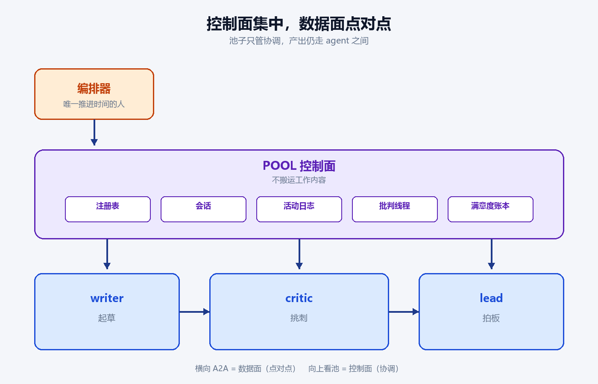
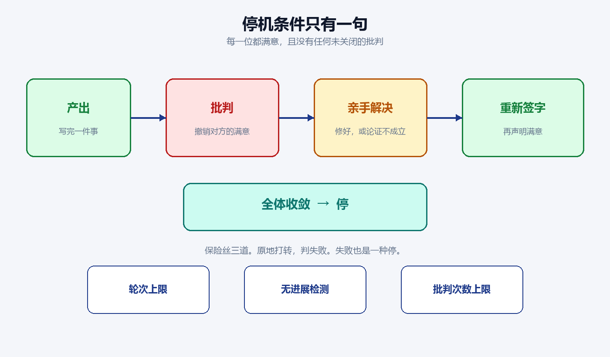
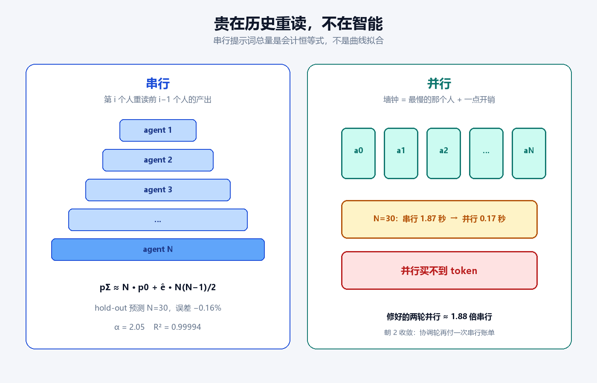
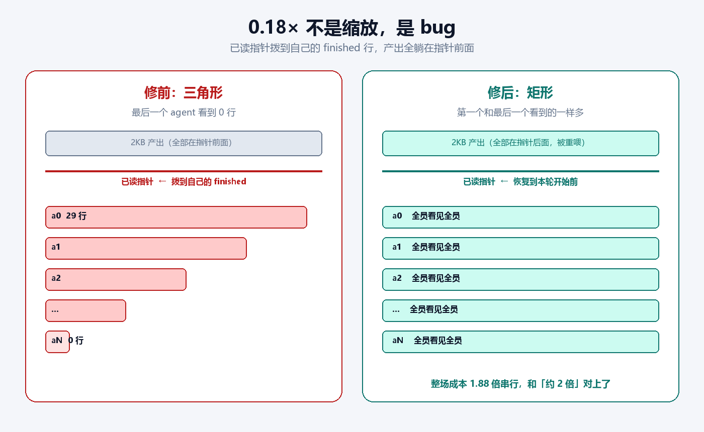

# 三个 AI 互相挑剔并不难。难的是让它们停下来。

项目地址：[github.com/yhyu13/CrossAgentMCP](https://github.com/yhyu13/CrossAgentMCP)

我想讲清楚的只有一件事：**多智能体真正难的不是让它们说话，是让它们停。** 停有定义，停有账单。数字一旦便宜得不像话，先查它们是不是根本没干活。

## 念头很浪漫

写代码久了，会有一种隐隐的孤独：写完一段自以为严密的逻辑，却没有人来挑毛病。Review 要成本，人要休息。于是盯着那个已经能帮我写代码的 AI，冒出一个念头——

**让几个 AI 互相 review，一直改到它们自己都觉得「行了」。**

念头听着简单。真做起来，撞上的不是「它们聪不聪明」，而是：**谁来宣布做完了？谁来保证它们不会永远聊下去，把 token 烧穿？**

市面上的协议，大多只回答前一半。

## 协议只管两个人说话

Google 的 Agent2Agent 协议（A2A）把两两通信定义得很干净：发消息、查任务、流式更新。它回答的是「我们俩怎么对话」，不是「我们一群人怎么把一件事干完，然后停」。

agent 一超过两个，地基就缺：

- 谁在？没有花名册。
- 一起干嘛？没有会话。
- 进展到哪了？每人只看得见自己的记录。
- 谁不满意？没有能拦住同伴的异议通道。
- **算不算完？** 没有停机条件。

没有这五块，所谓「多 agent」只是一堆各自为政的对话。对话可以永远进行下去。永远进行下去的系统，不叫协作，叫烧钱。

## 所以我先定义「停」

解法只有一句话：控制面和数据面分开。

控制面是协调账本：谁在场、一起干什么、进展到哪、谁不满意、能不能收场。数据面才是真正的产出和对话，仍然走 A2A，留在 agent 之间。池子不搬运工作内容，也就成不了瓶颈，更成不了谣言中转站。

三名员工很朴实：writer 起草，critic 挑刺，lead 整合拍板。编排器是唯一推进时间的人：喂增量，看状态，直到停机条件成立，或者保险丝熔断。

停机条件就一句：

> **每一位成员都满意，且没有任何一条未关闭的批判。**

关键不在「满意」这两个字，而在批判是一等公民。一条批判发出，就会**撤销被批判者已经声明的满意**。你不能自我感觉良好就收场。同伴不满意，会话就不能结束。你必须亲手解决——修好，或者论证它不成立——关掉线程，再重新签字。

保险丝有三道：轮次上限、无进展检测、批判次数上限。原地打转，判失败。失败也是一种停。

这就是这个小项目真正卖的东西。不是三个角色，不是一张架构图。是：**做完了有定义，做不完有出口。**

## 它会停。也很贵。

先证明会停，而且不必每次都烧大模型。

一条轨道是假 agent，机械回放「注册 → 产出 → 批判 → 满意度被撤销 → 伪造身份被拒绝 → 解决 → 全体收敛」。零成本，随时回归。另一条轨道是三个真的 Claude 无头 agent，去审一个真实代码库：5 轮收敛，223 行带文件行号的报告，0 条未关闭批判。

然后把「一个 agent 独自写完」和「三个角色互相挑剔」放在同一棵大约 589 个文件的文档树、同一个模型上对照：

| 模式 | 轮次 | 墙钟 | 成本 | 停了吗 |
|---|---|---|---|---|
| 单 agent 融合一轮 | 1 | 9.3 分钟 | $2.29 | 是 |
| 3-agent | 5 | 14.3 分钟 | $4.56 | 是，三方都满意 |

结论不营销：**并不更快，也不更便宜**（墙钟 ×1.54，成本 ×2）。买到的是角色拆分、强制交叉校验，以及上面那条停机条件。

N=3 只是一个点。人一多，代价怎么涨？不让大模型出场，用假 agent（每个睡 50 毫秒、吐 2KB）扫 N = 1、3、8、15、30。要的不是一张表，是一条能外推的式子。

先把两个词钉死。**花名册**是提示词里那份「现在有谁」的名单，人一多，每个人都要带一份，所以底价会随 N 涨。**已读指针**是每个 agent「上次看到活动日志的哪一行」：下一轮只取指针后面的新消息。协作贵不贵，几乎全看指针怎么走。

串行提示词总量是会计恒等式，不是曲线拟合：

> pΣ ≈ N · p0 + ê · N(N−1)/2
>
> p0 ≈ 941 + 27.57(N−1)（花名册），ê ≈ 2815 字节 / 每个已完成同伴。

每个 agent i 重读前 i−1 个人的产出，总和就是 N(N−1)/2 份事件字节。ê 在 N=3/8/15/30 几乎不变（2813、2814、2816、2818）。对数坐标上的斜率 α = 2.05，R² = 0.99994。用 N=3、8、15 预测 N=30：1,275,950 vs 实测 1,278,014，**误差 −0.16%**。这才叫定律。

贵不在智能，贵在每个人都要把越来越长的历史重新读一遍。按那场真跑的单价做相对折算（不是美元定律）：30 个 agent 串行大约是 3 个 agent 的 112 倍。

并行能买时间：N=30 串行 1.87 秒，并行 0.17 秒。墙钟变成「最慢的那个人 + 一点开销」。一轮并行的闭式仍是二次——pΣ = N · p0，花名册每人一份——但 N≤30 时常数项还压着，α 只有 1.24。**并行买不到 token。**

修好的两轮并行（第二轮让每个人看见每个人的产出）α = 1.96，相对串行从 2.53 收到 1.88，朝 2 收敛。机制简单：协调轮再付一次串行账单。

## 然后数字便宜得不像话

我本以为第二轮并行才是真正的协调，成本该直奔 N²。结果 30 个 agent 两轮并行，总共只有串行的 0.18 倍。

便宜到不正常。

查代码才发现：编排器在并行轮结束时，把每个 agent 的已读指针拨到了它自己「我做完了」的那一行；而这些收尾记录，写在所有人的产出之后。第二轮去取「上次之后的新消息」时，该被 review 的 2KB 产出全躺在指针前面。最后一个 agent 看到 0 行。

**那场 review 什么都没 review 到。** 0.18× 不是缩放，是 bug。

洞补上之后，第二轮从三角形变成矩形：第一个和最后一个看到的一样多。整场成本落在 **1.88 倍串行**，和「约 2 倍」对上了。

所以这一圈只留下三句话：

1. 协作能停，前提是你先写出停机条件。
2. 停很贵，贵在历史重读；串行 pΣ ∝ N²，hold-out 误差 0.16%。
3. **数字一旦便宜得不像话，先查它们是不是根本没干活。**

仓库里还有一套早期实现。同一棵文档树 9 轮 $7.57，停在「还在评审」——循环契约弱，不是评审更差。它留下的教训是全员互批的 N(N−1) 悬崖，现已写进正本的批判次数保险丝。那套代码冻结了。

## 这跟 vibe coding 有什么关系

这个项目绝大部分是 AI 写的。能力不在写得快。

能跑通不难。难的是每一个字节对回 A2A 规范；难的是在模糊处决定控制面和数据面分开、保险丝恰好三道；难的是伪造身份当场被拒绝，而不是「看起来像协作」。

更难的是用系统自己的方法审系统自己——先审别人的代码，再审自己，抓住死掉的状态机、流式回放竞态，以及上面那个假便宜。

**AI 可以帮你写，也可以帮你查写对了没有。前提是你先写下什么叫停，并且不把「便宜」当成胜利。**

## 写在最后

这个项目不大。它把一个浪漫念头收成三件事：跑得通，测得过，**真的会停**。

如果你也在用 AI 写点什么，欢迎来挑毛病。挑之前请先问一句：它们会停吗？你是怎么知道它们停了的？

## 想对照源码

停机条件在池的会话状态机里：全员满意且零条开放批判。并行默认把已读指针恢复到本轮开始前，下一轮才能看见同伴产出；旧行为不重喂，两轮并行会看起来很便宜。批判次数上限默认 200，超限判失败。
