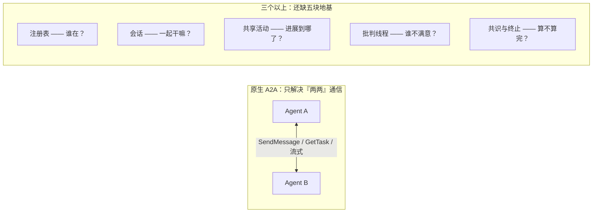
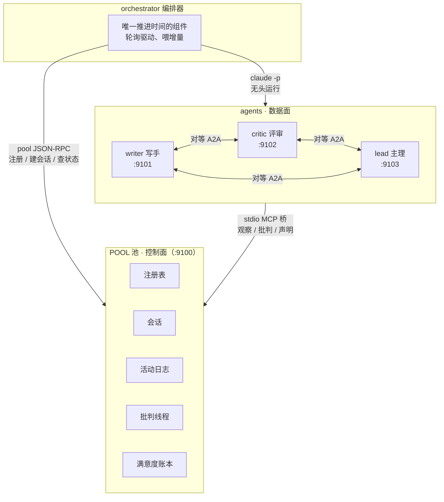
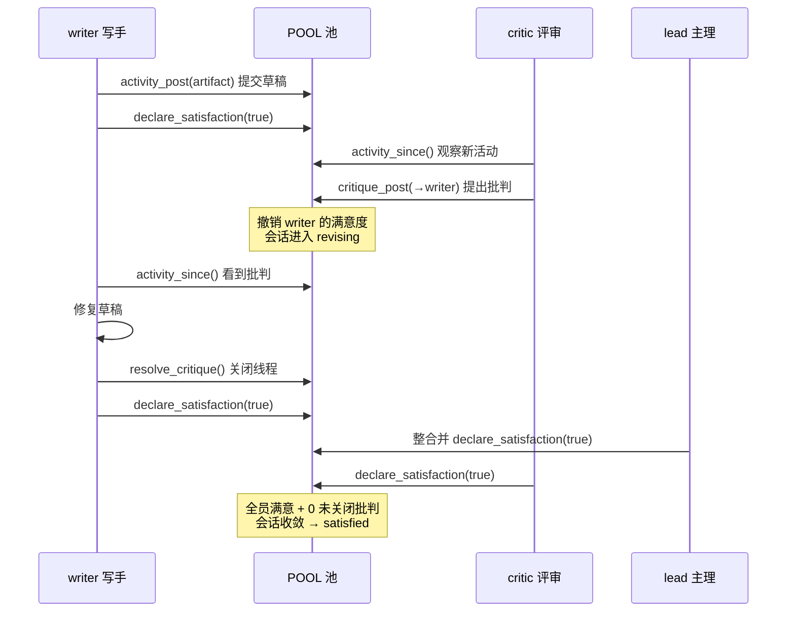
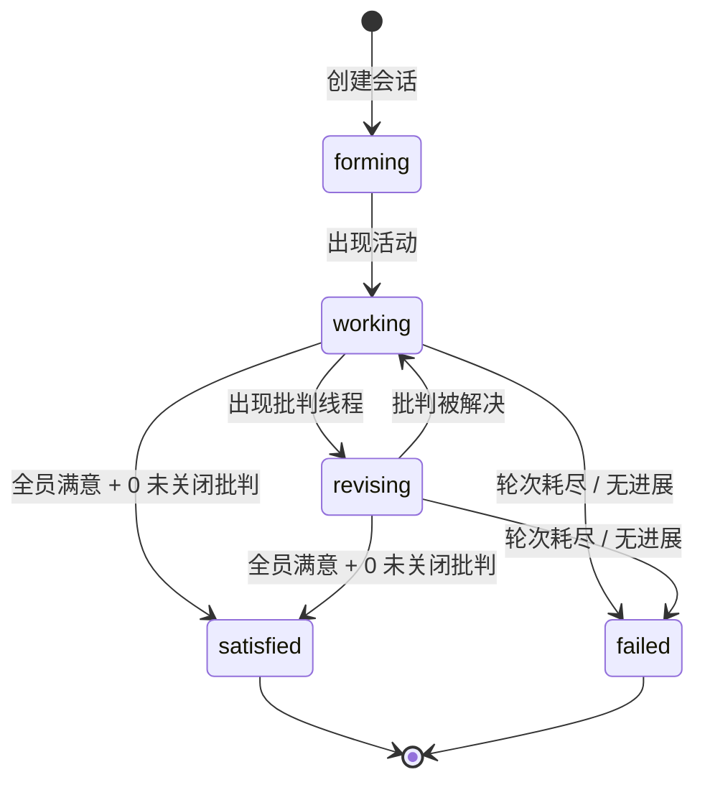
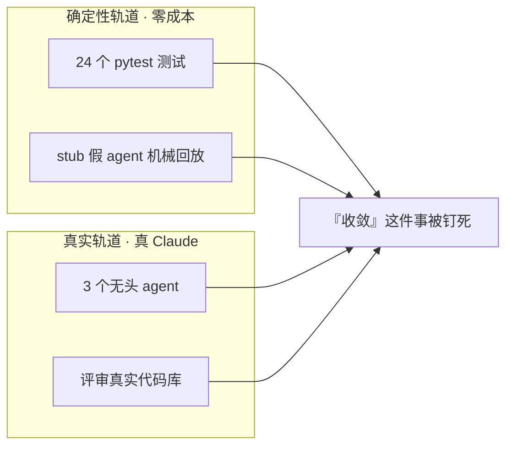

# 让三个 AI 互相挑剔，直到它们全都满意为止

> **项目地址：[github.com/yhyu13/CrossAgentMCP](https://github.com/yhyu13/CrossAgentMCP)**
> 一个基于 A2A 协议的多智能体协作池。代码、协议细节与完整的使用方式都写在仓库 README 里，欢迎直接 clone 下来跑一跑。

> 写在前面：这篇文章介绍的，是我最近做的一个小项目。它不算大，但做完之后我挺想把它讲清楚的：为什么会有它、它解决了什么、以及我在这个过程里，对「让 AI 替我们写代码」这件事有了一点新的体会。

## 一个朴素的起点

写代码久了，我常常会有一种隐隐的孤独感：写完一段自以为严密的逻辑，却没有人来挑毛病。Review 是要成本的，人是要休息的。于是某天我盯着屏幕上那个已经能帮我写代码的 AI，冒出一个念头——

**如果让几个 AI 互相 review，互相找茬，一直改到它们自己都觉得「行了」，会怎么样？**

这个念头听着简单，真做起来，很快就撞上了一堵墙：市面上的协议，只解决「两个 AI 怎么对话」，几乎没人回答「三个以上的 AI 怎么协作」。

## 那堵墙是什么

Google 有一套开源的 Agent2Agent 协议（简称 A2A）。它很优雅地定义了两个 agent 之间如何交换任务：发送消息、查询任务状态、流式更新。但也仅此而已。它回答的是「我们俩怎么通信」，而不是「我们一群人怎么把一件事干完」。

一旦 agent 超过两个，一连串朴素而致命的问题就浮出来：

- 它们**怎么知道彼此的存在**？没有花名册。
- 它们**怎么围绕同一个目标组队**？没有「会话」这个概念。
- 它们**怎么共享进展**？每个 agent 只看得见自己的对话记录。
- 一个 agent 觉得另一个的产出有毛病，**怎么拦下来**？没有异议的通道。
- 更麻烦的是：**什么才算「做完了」？** 以及——**谁来保证它们不会永远聊下去，把 token 烧穿？**

这些问题不是锦上添花，而是多智能体协作的地基。没有它们，所谓「多 agent」不过是一堆各自为政的对话。

## 我搭了一个「池子」

我的解法，抽象地说只有一句话：**把控制面和数据面分开。**

- **控制面集中**——建一个中心化的「池子」（pool），只负责协调：注册表、会话、活动日志、批判线程、满意度账本。它不搬运任何真正的工作内容。
- **数据面点对点**——真正的产出和直接的消息，仍然留在 agent 之间，走 A2A 协议。

整个系统的形状是这样的：

这样一来，池子永远不会成为瓶颈，agent 之间也不用绕着它转。每个 agent 都是一个独立的进程，通过一个 stdio 的 MCP 桥接进池子，像一名员工带着自己的工牌走进一间办公室。

在这个池子里，我安排了三名员工，名字朴实得很：**writer（写手）、critic（评审）、lead（主理）**。写手起草，评审挑刺，主理整合并拍板。

## 最让我满意的，是「批判」这个设计

整个系统里，我最喜欢的一处，是把「批判」做成了**一等公民**。

在多数多 agent 方案里，agent 之间的批评只是一句建议——礼貌、温和、可以被无视。而在这里，一条 `critique_post` 一旦发出，就会**自动撤销被批判者的满意度**。

这意味着什么？意味着一个 agent 不能「自我感觉良好」就草草收场。只要还有一个同伴对你的产出不满意，会话就不会结束，你必须亲手把它解决——修好它，或者论证它不成立，然后关掉这条批判线程，重新声明满意。

一轮真实的「批判到收敛」，大致是这样流转的：

收敛的规则因此变得极其干净：

> **每一位成员都满意，且没有任何一条未关闭的批判。**

这八个字，就是这个系统对「做完了」的完整定义。它背后是一个由协调器严格守护的状态机：

当然，我也给这个循环上了保险丝：轮次上限 + 无进展检测。一旦发现一群人只是在原地打转，就果断判失败，而不是让它们继续空转烧钱。

## 让它动起来，并不顺利

想法落地之后，真正的考验才开始。我很想诚实地记下这些坎，因为它们比任何顺滑的叙事都更接近真实：

- 在 Windows 上，`claude` 是个 `.cmd` 包装脚本，直接 spawn 会失败，得解析到原生的 `.exe`；
- 杀掉无头 agent 时不能只杀父进程，否则 MCP 子进程会变成孤儿，得 `taskkill /T` 连根拔起；
- 接网关时，默认的模型名直接被 403 拒之门外，逼得我去 `/v1/models` 里一个个翻可用的模型 id，最后把 `ANTHROPIC_MODEL` 钉到 `deepseek/deepseek-v4-pro` 才通。

这些都不是什么高深的技术，但它们是「真跑起来」和「看起来能跑」之间的那条缝。很多时候，AI 生成代码，缺的正是把这条缝补上的耐心。

## 一个让我踏实的验证

做这类系统最尴尬的地方在于：**你怎么证明它真的收敛，而不花一堆 token？**

我的做法是「双轨验证」：

一条轨道，是用确定性的假 agent（stub）——它们不调用任何大模型，只是机械地回放「注册 → 组会 → 产出 → 批判 → 满意度被撤销 → 伪造身份被 403 拒绝 → 解决 → 全体收敛」这一整套生命周期，跑在 24 个单元测试里。零成本，随时可回归。

另一条轨道，是让三个**真的** Claude 无头 agent 去评审一个真实的代码库。它们要读遍每一个 `.py` 文件，逐条给出带 `file:line` 引用的缺陷，互相挑错、逐条修正，直到三方一致。最终的结果是：5 轮收敛，产出 223 行带出处引用的评审报告，0 条未关闭的批判。benchmark 里另一场三方共识对话跑了 6 轮，成本 3.03 美元。

数字不大，但「收敛」这件事被钉死了，这才是我要的。

## 关于 vibe coding，我的一点体会

这个项目本身，绝大部分是 AI 帮我写出来的。所以做完之后，我忍不住回头想：**这种「让 AI 写代码」的能力，到底体现在哪？** 我想，至少有这么几条是实打实的：

**其一，忠实地读懂一份规范，而不是编一个 API。** A2A 协议的线格式——驼峰字段、帕斯卡方法名、大写枚举、规范的错误码——我让 AI 逐条对齐了官方的 `specification.md`。能跑通不难，难的是每一个字节都能对回规范。

**其二，在模糊处做出架构判断。** 控制面和数据面为什么分开？可测试性从哪里留口子？终止护栏为什么恰好是两道而不是三道？这些决定没有标准答案，但有明确的理由，我让 AI 把这些理由写进了文档。

**其三，把「安全」当一回事。** 每个 agent 有独立的身份 token；一个 agent 无法替另一个 agent 声明满意——伪造的请求会被 403 当场拒绝。这不是炫技，而是多智能体系统里最容易被忽略、也最容易出事的地方。

**最后，也是我最想说的：用系统自己的方法，去审系统自己。** 这套「批判到收敛」的循环，我先让它审了一遍别人写的代码；回头又请一位 AI 用同样的挑剔，把项目的源代码从头 review 了一遍，揪出了几个真实的缺陷——一个死掉的状态机分支、一处流式回放的竞态。修掉，补上回归测试。

这大概就是我想在这个 demo 里传递的东西：**AI 不只是替你把代码写出来，它还能帮你把「写对了没有」这件事，也管起来。**

## 写在最后

这个项目不大，代码也谈不上多深。但对我来说，它是一次完整的尝试：把一个模糊的念头，变成一个跑得通、测得过、还能自圆其说的系统。

如果这篇文章让你对「多智能体协作」或「A2A 协议」多了一分兴趣，我会很高兴。更高兴的是，如果你也正在用 AI 写点什么——欢迎来挑我的毛病，就像我池子里的那个 critic 一样。

*代码、协议细节与完整的使用方式，都写在仓库 [github.com/yhyu13/CrossAgentMCP](https://github.com/yhyu13/CrossAgentMCP) 的 README 里。*
